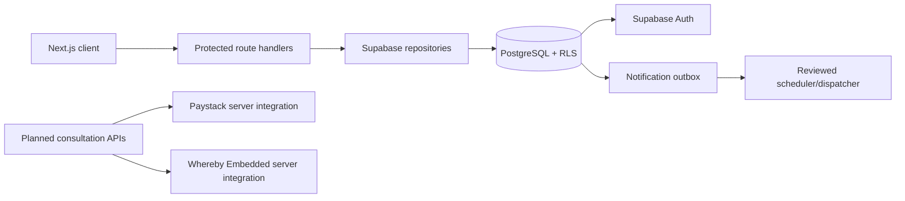

# Current architecture

> Last verified against code: 2026-09-24  
> Repository branch: `design/mymama-premium-ui`  
> Commit: `1e35386`

## Runtime shape

My MAMA is a single Next.js 16 App Router application written in TypeScript. The root route is server rendered: `app/page.tsx` creates a Supabase server client, checks the cookie-backed user session, and renders either the public journey-start experience or the authenticated `MamaApp`. Client interaction lives mainly in `app/mama-app.tsx` and reusable components under `components/mama/`.

The application is deployed from the repository through Vercel. `next.config.ts` only disables the powered-by header; there is no checked-in `vercel.json` or application CI workflow in this repository. The package manager is pnpm and the lockfile is committed.

## Request and data flow

Browser components use `lib/supabase/client.ts` for authenticated client calls. Server components and route handlers use `lib/supabase/server.ts`, which creates the SSR client with request cookies. `proxy.ts` delegates session refresh to `lib/supabase/proxy.ts`; the callback route exchanges the auth code and redirects to the requested safe path.

The API routes are thin authenticated boundaries:

- `/api/records` reads and mutates care records through `lib/repositories/care.ts`.
- `/api/care-details` handles medication and investigation records through `lib/repositories/care-details.ts`.
- `/api/engagement` handles tasks, reminders, achievements, notifications, and preferences through `lib/repositories/engagement.ts`.
- `/api/demo` seeds, switches, hides, shows, and deletes the per-user demo space through `lib/repositories/demo.ts`.
- `/api/push-subscription` stores browser push subscriptions.
- `/api/sharing` reads patient-owned sharing permissions.

The repositories adapt relational rows to the current UI model. Supabase RLS remains the authoritative authorization boundary; route handlers also require a signed-in user and validate request origins where state changes are made.

## UI and navigation

`components/mama/navigation.tsx` defines the authenticated desktop views and `components/mama/mobile-bottom-navigation.tsx` provides the persistent mobile navigation. `components/mama/home-visual-prototype.tsx` is the reusable home-state visual layer for cycle, pregnancy, and postpartum experiences. `components/mama/public-journey-start.tsx` and `components/mama/public-landing.tsx` provide public landing/onboarding paths. The UI uses Tailwind/PostCSS plus the large shared stylesheet in `app/globals.css` and shadcn-style primitives in `components/ui/`.

`/design-preview` is a preview-only Design Lab route. It is blocked in Vercel production by `notFound()` and has fixture-only state controls; it never reads care data.

## Authentication and authorization

Supabase email/password authentication is used. Signup, signin, recovery, confirmation, and callback UI are in `components/mama/auth-form.tsx`, `app/sign-in/page.tsx`, `app/reset-password/page.tsx`, and `app/auth/callback/route.ts`. Profile and care rows are keyed to `auth.users.id`. Clinician access is mediated by `user_roles`, provider rows, accepted/completed bookings, and patient-controlled sharing scopes.

## Database and migrations

The schema is versioned under `supabase/migrations/` and type output is represented by `lib/supabase/database.types.ts`. The initial migration creates profiles, journeys, pregnancy/postpartum contexts, care records, providers, consultation service/availability/booking foundations, sharing, content, and audit tables. Later migrations add engagement/notifications, demo separation, lifelong-care records, journey personalization, and featured/default provider fields. See [docs/DATABASE.md](docs/DATABASE.md) for the table-level inventory.

## Notifications

Notification preferences, an in-app outbox, push subscriptions, and delivery logs are modeled in Supabase. A Postgres function queues generic due reminders and appointment reminders. `supabase/functions/notification-dispatch/index.ts` is a deployment-gated delivery skeleton; it does not currently provide a complete external push provider or scheduled production worker. Lock-screen copy is intentionally generic.

## Consultation boundary

The repository contains database primitives for providers, services, availability, and bookings, plus a Design Lab fixture for Dr Peace. It does not contain a patient consultation booking flow, slot-hold/expiry service, Paystack checkout/webhooks/refunds, Whereby room provisioning, consultant dashboard, or production consultation notifications. The active implementation plan records the intended next architecture.

## Planned / not yet implemented architecture

The planned consultation system is a separate server-authoritative workflow: patient intake and safety gate, provider/service discovery, real availability, expiring slot hold, booking, Paystack verification, confirmed booking, private Whereby room, reminders, consultation, private clinician notes, and explicitly published patient summary. It must extend the current repositories and RLS model rather than create a parallel data store.

